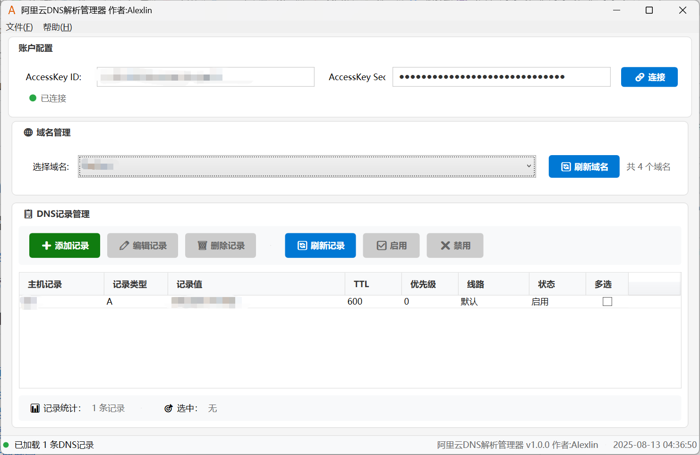

# AliDnsManager · 阿里云 DNS 解析管理器

[中文][English](./readme-EN.md)

一个用于管理阿里云 DNS 解析记录的WPF桌面应用。

## 目录（TOC）

- 中文
  - [简介](#简介)
  - [系统要求](#系统要求)
  - [快速开始](#快速开始)
  - [使用指南](#使用指南)
  - [界面截图](#界面截图)
  - [注意事项](#注意事项)
  - [许可证](#许可证)

---

## 简介
- 连接阿里云 DNS API，支持查看域名与管理解析记录（增删改查、启用/禁用）
- 支持多记录类型：A、AAAA、CNAME、MX、TXT、NS、SRV、CAA
- 本地配置安全加密保存（Windows DPAPI）
- 现代化 WPF 界面

### 系统要求
- Windows 10/11
- .NET 9.0 Runtime

### 快速开始
1. 获取阿里云 RAM 用户 AccessKey（最小权限）
2. 启动应用，在“账户配置”中输入 AccessKeyId/AccessKeySecret，点击“连接”
3. 在“域名管理”选择域名，进行记录的新增、编辑、删除、启用/禁用

### 使用指南
- 连接：输入有效凭证后连接成功并自动加载域名
- 域名：下拉选择域名，支持刷新列表
- 记录：支持新增、编辑、删除、刷新、启用/禁用；支持 A/AAAA/CNAME/MX/TXT/NS/SRV/CAA
- 配置：密钥加密存储；可通过菜单清除

### 界面截图

### 注意事项
- 请妥善保管 AccessKey，不要提交到公共仓库
- 删除记录不可恢复，请谨慎操作
- 部分记录类型需要特定值格式（如 MX 的优先级）

### 许可证
- 本项目仅供学习与个人使用

## 相关文档
- 打包：请参见 [deploy.md](./deploy.md)

## 关于作者
 [博客](https://smlin0513.cn)
# 感觉可以点个star⭐