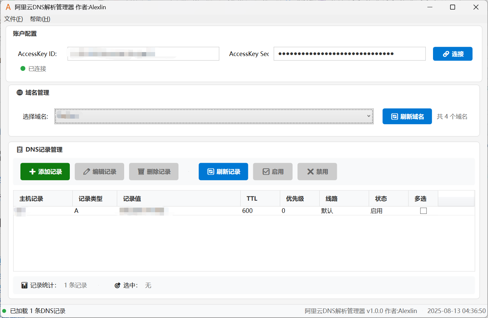
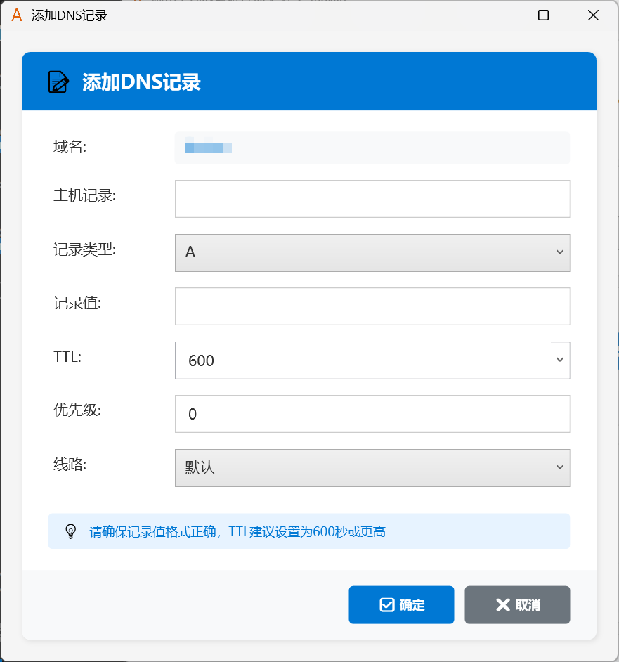
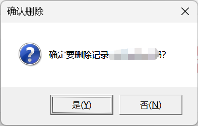
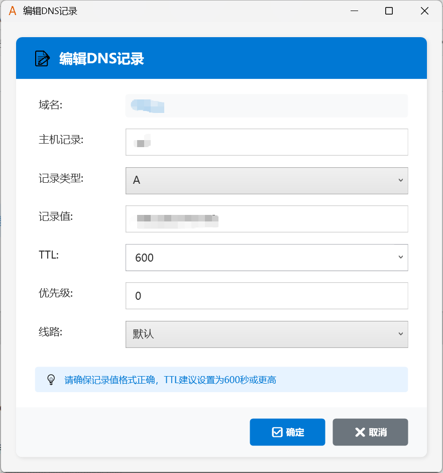

# AliDnsManager · Alibaba Cloud DNS Manager (WPF)

[中文](./README.md)[English]

A modern desktop app to manage Alibaba Cloud DNS records.

## Table of Contents
- [Introduction](#introduction)
- [Features](#features)
- [Requirements](#requirements)
- [Quick Start](#quick-start)
- [Screenshots](#screenshots)
- [License](#license)
- [Related Docs](#related-docs)

## Introduction
A desktop app that connects to the AliDNS API, lets you list domains and manage DNS records.

## Features
- Connect to AliDNS API; list domains; manage DNS records (CRUD); enable/disable
- Supported record types: A, AAAA, CNAME, MX, TXT, NS, SRV, CAA
- Secure local config storage (Windows DPAPI)
- Modern WPF UI

## Requirements
- Windows 10/11
- .NET 9.0 Runtime

## Quick Start
1. Prepare a RAM user AccessKey with least privilege
2. Launch the app, enter AccessKeyId/AccessKeySecret, click Connect
3. Select a domain and manage records (add/edit/delete/enable/disable)

## Screenshots

## License
- For learning and personal use only

## Related Docs
- Packaging: see [deploy.md](./deploy.md)

## aboutauthor
 [blog](https://smlin0513.cn)